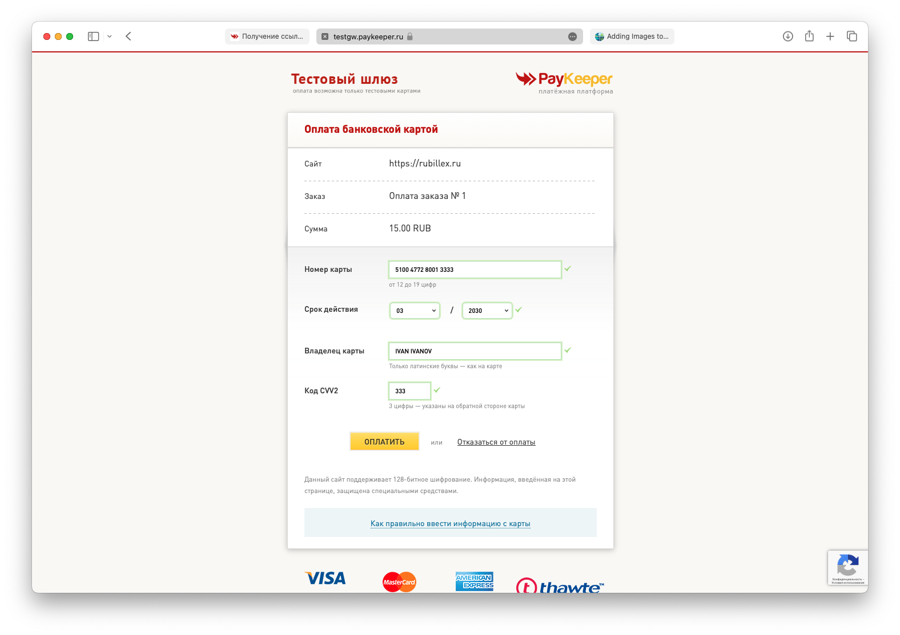
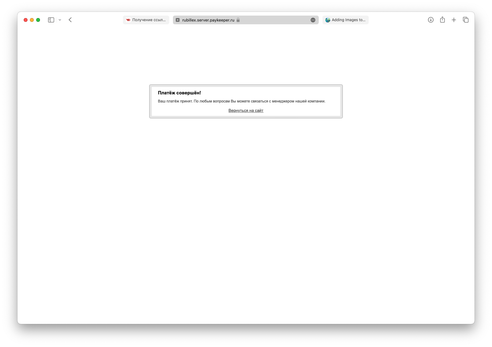

# Card validation

## Project Setup

```sh
npm install
```

```sh
npm install --global yarn
```

```sh
yarn install
```

### Start Development version

```sh
npm run dev
```

# Описание проекта

## структура проекта

1. Каталог товаров
2. Страница просмотра товаров
3. Корзина
4. Страница оплаты заказа

## Используемые технологии

1. Vue.js 3 - фреймворк для написания фронтенд приложений.
2. TypeScript - язык программирования на котором был написан проект. TypeScript расширяет возможности JavaScript.
3. pinia - расширение для Vue.js. Используется для сохранения информации в localStorage браузера. В проекте используется для хранения информации о товарах + для сохранения корзины.
4. vue-router - Расширение для Vue.js. Используется в создании Single Page Application(SPA). SPA - это приложения с обновлением информации без перезагрузки страницы.

## Работа приложения

Для запуска проекта используется команда `npm run dev`, которая запустить dev версию приложения без компиляции в обычный html, css и js. После этого в консоли с запущенной командой по запуску приложения будет отображаться ссылка на это приложение. Если перейти по ней, откроется сайт.

Каталог товаров записан в локальное хранилище браузера, с помощью pinia. в формате массива объектов, описанных с помощью TypeScript. Описание товара:

```typescript
export interface TProduct {
    id: number,
    name: string,
    image: string,
    price: number,
    description: string,
}
```
 Описание каталога товаров:
```typescript
import { defineStore } from "pinia"
import type { TProduct } from "@/types/TProduct";

type State = {
    products: TProduct[]
}

export const productStore = defineStore({
    id: 'store',
    state: (): State => {
        return {
            products: [
                {
                    id: 1,
                    name: 'Смартфон HONOR X8a 128GB Серебристый',
                    description: 'HONOR X8a - это сочетание изысканного и функционального дизайна. Особое покрытие эффектно выглядит и ловит каждый луч света. Тонкие рамки максимально расширяют полезную площадь экрана, обеспечивая незабываемые визуальные впечатления. Безграничность в пределах досягаемости.',
                    price: 37890,
                    image: '/images/img.png'
                },
                {
                    id: 2,
                    name: 'Смартфон Xiaomi Redmi Note 12 4G',
                    description: 'Смартфон поддерживает 3 разных частоты обновления экрана (60 Гц / 90 Гц / 120 Гц) для плавного изображения и низкого энергопотребления. Наслаждайтесь непревзойденным качеством изображения с высокой частотой обновления до 120 Гц, как в серьезных игровых баталиях, так и во время простого просмотра ленты социальной сети.',
                    price: 11600,
                    image: '/images/img_1.png'
                },
                {
                    id: 3,
                    name: 'Смартфон realme C21Y 32 ГБ черный',
                    description: 'Камера realme C21Y состоит из 3 модулей: основного на 13 Мп. Емкий аккумулятор на 5000 мАч позволит забыть о регулярной подзарядке на протяжении дня, а функция обратной зарядки — использовать смартфон в качестве внешнего аккумулятора для других устройств. Разблокировка realme C21Y по отпечатку пальца происходит невероятно быстро и с гарантией безопасности. Также для разблокировки предусмотрено распознавание лица.',
                    price: 14700,
                    image: '/images/img_2.png'
                },
                {
                    id: 4,
                    name: 'Смартфон Honor X9a 6GB/128GB Изумрудный зеленый',
                    description: 'Смартфон HONOR X9a премиум дизайна в тонком корпусе 7.9 мм и с большой батареей 5100 мАч, которая обеспечивает двухдневную работу без подзарядки. Новая модель Х9а поддерживает быструю зарядку HONOR SuperCharge мощностью 40Вт. ',
                    price: 44300,
                    image: '/images/img_3.png'
                },
            ],
        }
    },
    getters: {
        // Функция получения информации о всех продуктах
        allProducts({products}): TProduct[] {
            return products
        },
        // Функция получения одного продукта по его ID
        getProductById({products}): (id: number) => TProduct | undefined {
            return (id: number): TProduct | undefined => {
                return products.find((product) => product.id === id)
            }
        }
    }
});
```

По клику на карточку товара открывается страница просмотра данного товара. На странице доступна кнопка "Купить", которая добавляет товар в корзину.

Описание корзины: 

```typescript
import {defineStore} from "pinia"
import type {TCart} from '@/types/TCart';
import type {TProduct} from "@/types/TProduct";

type  State = {
    cart: TCart
}

export const cartStore = defineStore({
    id: 'cart',
    state: (): State => {
        return {
            cart: {
                object: []
            }
        }
    },
    getters: {
        getCart({cart}): TCart {
            return cart
        },
    },
    actions: {
        //функция добавления продукта в корзину
        addItemToCart(item: TProduct) {
            const cartItem = this.cart.object.find((el) => el.id === item.id);

            if (cartItem) {
                cartItem.count++;
                return;
            }

            this.cart.object.push({id: item.id, count: 1});
        },
        //функция удаления продукта из корзины
        removeItemFromCart(item: TProduct) {
            //получаем продукт из корзины
            const cartItem = this.cart.object.find((el) => el.id === item.id);
            //если он там есть заходим в функцию
            if (cartItem) {
                //уменьшаем число данных товарав на 1
                cartItem.count--;
                //если товаров осталось 0
                if (cartItem.count === 0) {
                    //удаляем запись о данном товаре из корзины
                    this.cart.object.splice(this.cart.object.indexOf(cartItem), 1);
                }
            }
        },
        //очистка корзины
        clearCart() {
            this.cart.object = [];
        },
    },
    persist: true,
});
```

Описание объекта корзины:

```typescript
export interface TCart {
    object: TCartObject[]
}

export interface TCartObject {
    id: number,
    count: number
}
```

Если товар находится в корзине, то, вместо кнопки "Купить", будут отображаться кнопки плюс и минус. Также будет отображаться текущее число экземпляров в корзине.

В шапке сайта есть корзина, которая активна только в том случае, если в корзину добавлен хотя бы один товар.

На странице корзины есть возможность посмотреть информацию о добавленных товарах, а также их количество и стоимость. В нижней части страницы отображается итоговая цена и кнопка "Оформить", по клику, на которую открывается форма оформления заказа.

Форма оформления заказа содержит в себе поля для заполнения данных банковской карты. Данная форма динамически меняется в зависимости от того, к какой платежной системе относится карта. Тип платежной системы определяется с помощью регулярных выражений
```js
// получение типа карты
const getCardType = computed(() => {
    let number = cardNumber.value;
    // если в поле "номер карты" ничего не введено
    if (number.length < 1) {
        return;
    }
    // если начинается с "4" - Vise
    let re = new RegExp("^4");
    if (number.match(re) != null) return "visa";
    
    // если начинается с "2" - Мир
    re = new RegExp("^2");
    if (number.match(re) != null) return "mir";
    
    // если начинается с "34" или "37" - American Express
    re = new RegExp("^(34|37)");
    if (number.match(re) != null) return "amex";

    // если в начале от одной до пяти пятерок - MasterCard
    re = new RegExp("^5[1-5]");
    if (number.match(re) != null) return "mastercard";

    // если начинается с "6011" - Discover
    re = new RegExp("^6011");
    if (number.match(re) != null) return "discover";

    // если начинается с "3566" - JCB
    re = new RegExp("^3566");
    if (number.match(re) != null) return "jcb";
    
    re = new RegExp("^3056");
    if (number.match(re) != null) return "dinersclub";

    re = new RegExp("^6200");
    if (number.match(re) != null) return "unionpay";

    return "";
});
```

# Описание платежки

В качестве платежной системы был использован сервис "paykeeper". Подключение было произведено с помощью API запросов. Чтобы получить ссылку для оплаты, требуется выполнить следующий скрипт:

```javascript
const baseUrl = 'https://rubillex.server.paykeeper.ru';
const base64 = window.btoa('login:password');

//считаем стоимость корзины
const allPrice = computed(() => {
    let sum = 0;
    cart.object.forEach((el) => sum += (productsStore.getProductById(el.id).price) * el.count);

    return sum;
});

let token = null;

// запрос на получение токена
axios.get(`${baseUrl}/info/settings/token/`, {
    headers: {
        Authorization: `Basic ${base64}`,
        'Content-Type': 'application/x-www-form-urlencoded'
    }
}).then((res) => {
    token = res.token;
});

//платежные данные
const paymentData = {
    pay_amount: allPrice,
    clientid: fullName,
    //Генерируем случайный ID заказа на основе текущего времени
    orderid: Date.now(),
    client_email: email,
    service_name: 'Товар',
    token
};

// посылаем запрос на получение ссылки для оплаты
axios.post(`${baseUrl}/change/invoice/preview/`, paymentData, {
    headers: {
        Authorization: `Basic ${base64}`,
        'Content-Type': 'application/x-www-form-urlencoded'
    }
}).then((res) => {
    window.open(res.invoice_url, '_blank');
});
```

После этого мы попадаем на страницу оплаты. В нашем случае используется тестовый шлюз, следовательно и оплата производится с тестовых карт.



После успешной оплаты мы видим следующее:



По нажатии на "Вернуться на сайт" пользователь попадает на главную страницу сайта.